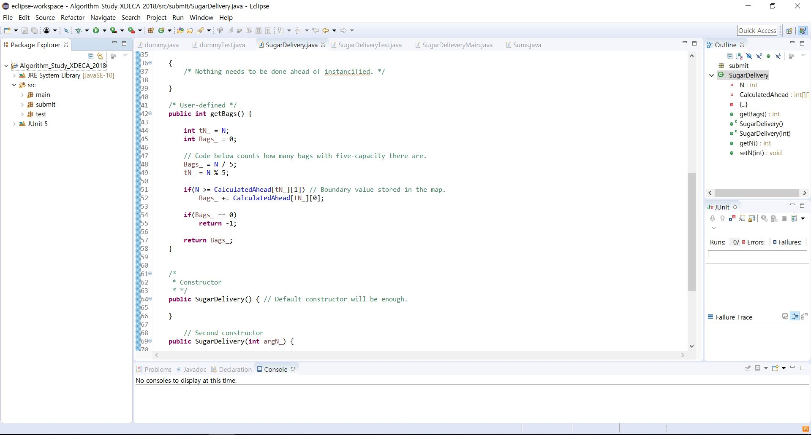

# X[Deca] Algorithm Study 2018

### Description
 This is the repository of personal sources that I made for algorithm study mostly in the base, since I am currently working at ROK Air Force. 
 
 Thus all the commits except the initial one will be done manually with web browsers. 
 

### Environment
 Development environment of each source will vary from time to time. Comments stated in each file will describe the specific environment used. If it is done with Eclipse, all sources will be tested with JUnit first, and then submitted. 
 
 I mostly used the language JAVA. It is the most familiar language for me right now('18.05.), since I am currently working on JSP/Java projects.
 
 

 Since I usually don't have the access to Eclipse, I might use the Goorm IDE, the web-based development environment. The link is stated below.

 > <https://ide.goorm.io/>
 
 
### Note that..
 All problems of each sources are from the site, 
 
 > <https://www.acmicpc.net/>
 
 
 This site allows us auto-checking if the code provides a correct solution for each problem. However, from the experience, even though the code works perfectly, auto-checking system sometimes gives message that the code is not the correct solution. So do not always believe the message as an absolute result.

